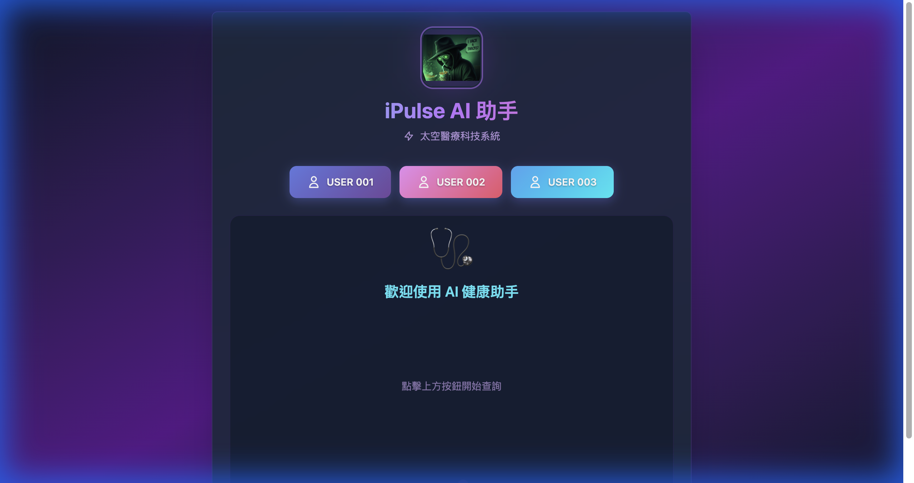

# RAG POC 專案說明

提供廠商與專案協作人員閱讀的架構及流程文件。

**文件版本：v0.2.0｜更新日期：2026-09-22**

本儲存庫收錄說明文件、流程圖片與可編輯的圖表原稿。圖表用於說明系統分工與業務流程，不作為功能驗收或正式環境部署狀態的證明。

## 文件目錄

| 順序 | 文件 | 說明 |
|---|---|---|
| 01 | [專案介紹](docs/01-overview.md) | 專案目的、角色與功能範圍 |
| 02 | [系統架構](docs/02-architecture.md) | 功能分層與服務關係 |
| 03 | [完整流程](docs/03-flow-overview.md) | 資料準備到問答回應的全貌 |
| 04 | [資料處理流程](docs/04-data-flow.md) | 匯入、向量化、規則處理與資料管理 |
| 05 | [問答流程](docs/05-query-flow.md) | 請求、檢索、生成與回應 |
| 06 | [文件維護方式](CONTRIBUTING.md) | 修改、審閱與版本發布 |
| 07 | [版本紀錄](CHANGELOG.md) | 各版文件變更 |

## 閱讀方式

先閱讀專案介紹與架構，再依工作範圍閱讀資料或問答流程。圖表以 PNG 圖片直接顯示，可點選「放大查看」；Mermaid 原稿另存於 diagram-sources，供後續改版。

程式碼、部署設定、帳號資訊、內部檢核紀錄及測試原始資料不包含在本儲存庫。

## 實際畫面導覽

五個主要章節均附交付資料的實際畫面，可由下表選擇閱讀。截圖取自 2026 年 2 月交付紀錄，不代表目前線上狀態。

| 章節 | 搭配的實際畫面 |
|---|---|
| [專案介紹](docs/01-overview.md#交付資料實際畫面) | iPulse 登入入口、AI 助手 |
| [系統架構](docs/02-architecture.md#交付資料實際畫面) | Swagger API、健康紀錄工作流 |
| [完整流程](docs/03-flow-overview.md#交付資料實際畫面) | JSON 上傳、匯入工作流、網頁問答、AI 助手 |
| [資料處理](docs/04-data-flow.md#交付資料實際畫面) | 上傳表單、JSON／CSV 工作流、規則提取、資料管理 |
| [問答流程](docs/05-query-flow.md#交付資料實際畫面) | 問答入口、AI 助手、健康紀錄工作流、API 文件 |

### iPulse AI 助手預覽

[查看完整畫面](assets/screenshots/portal-assistant.png)
