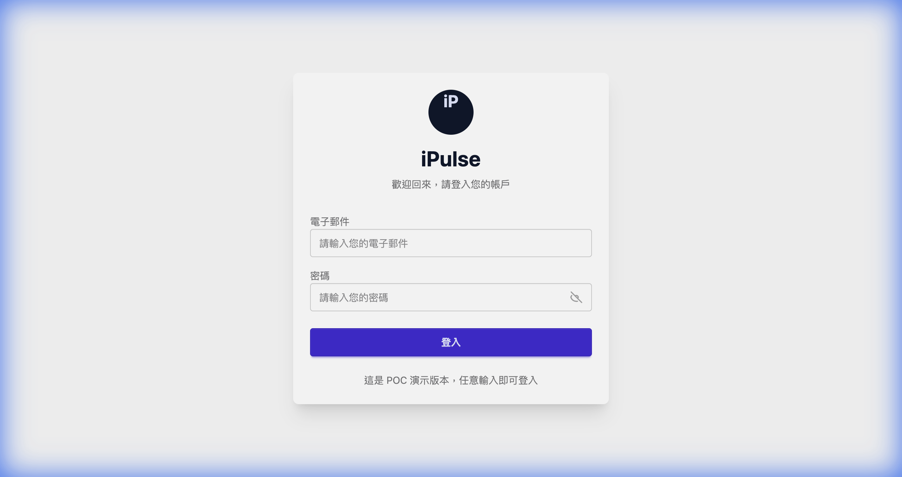

# 專案介紹

[返回目錄](../README.md)

## 專案目的

RAG POC 以資料匯入、向量檢索與語言模型為核心，提供健康紀錄及相關知識的查詢介面，讓使用者透過網頁或 Portal 提問並閱讀整理後的回答。

## 功能範圍

| 類別 | 說明 |
|---|---|
| 資料準備 | JSON、CSV、PDF 的解析與資料整理 |
| 資料檢索 | 使用者紀錄查詢與文字相似度檢索 |
| AI 問答 | 將問題與檢索內容整理成回答 |
| 規則處理 | 規則資料的整理及儲存 |
| 操作入口 | Portal、上傳、問答與資料管理介面 |

## 文件使用者

- 專案窗口：了解功能範圍與文件版本。
- 協作廠商：了解各服務的職責及串接關係。
- 維護人員：依架構與流程文件定位相關服務。

本版聚焦系統概念與文件交接，不包含程式實作與環境操作指令。

## 交付資料實際畫面

以下為 2026-02-08 交付紀錄所附的原始截圖，用於對照介面與工作流。畫面保留當時版本，並非本次重新操作或執行結果；配置細節可能與概念流程圖不同。

### iPulse 登入入口

交付時的 POC 登入頁，顯示電子郵件、密碼輸入及登入按鈕。

[放大查看](../assets/screenshots/portal-login.png) · 原始檔：`4.2_iPulse_Home.png`

### iPulse AI 助手

顯示 USER 001／002／003 測試使用者入口及 AI 助手歡迎畫面。

[放大查看](../assets/screenshots/portal-assistant.png) · 原始檔：`4.2_iPulse_Pass.png`

