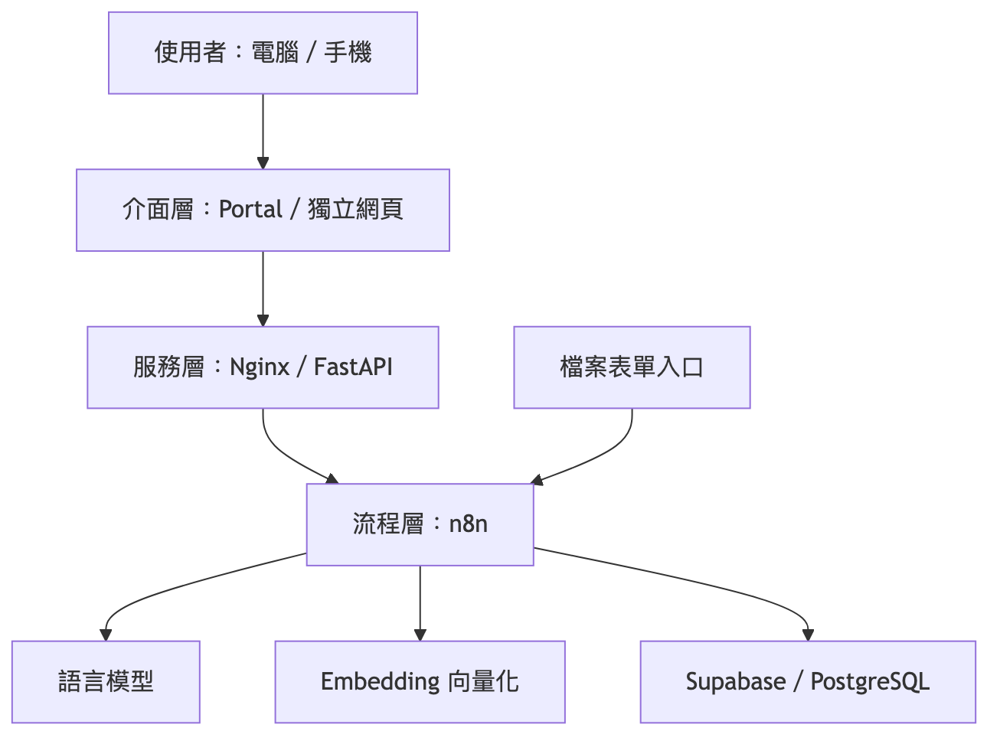

# 系統架構

[返回目錄](../README.md)

## 功能分層

[放大查看](../assets/diagrams/02-architecture-1.png) · [圖表原稿](../diagram-sources/02-architecture-1.mmd)

此圖為功能分工示意；表單與 API 是不同入口。

## 服務呼叫關係

[放大查看](../assets/diagrams/02-architecture-2.png) · [圖表原稿](../diagram-sources/02-architecture-2.mmd)

實體部署涉及 Windows、WSL 與 Docker。此對外說明以服務關係呈現，環境位址及連接埠由部署文件另行管理。

| 元件 | 職責 |
|---|---|
| Portal／獨立網頁 | 接收操作、呈現結果 |
| Nginx | 網頁服務與請求轉發 |
| FastAPI | 認證、請求整理、追蹤與回應格式化 |
| n8n | 編排解析、資料查詢、檢索與模型呼叫 |
| 語言模型 | 問題處理與回答生成 |
| Embedding | 將文字轉為檢索向量 |
| Supabase／PostgreSQL | 資料與向量儲存，以及相關流程資料管理 |
