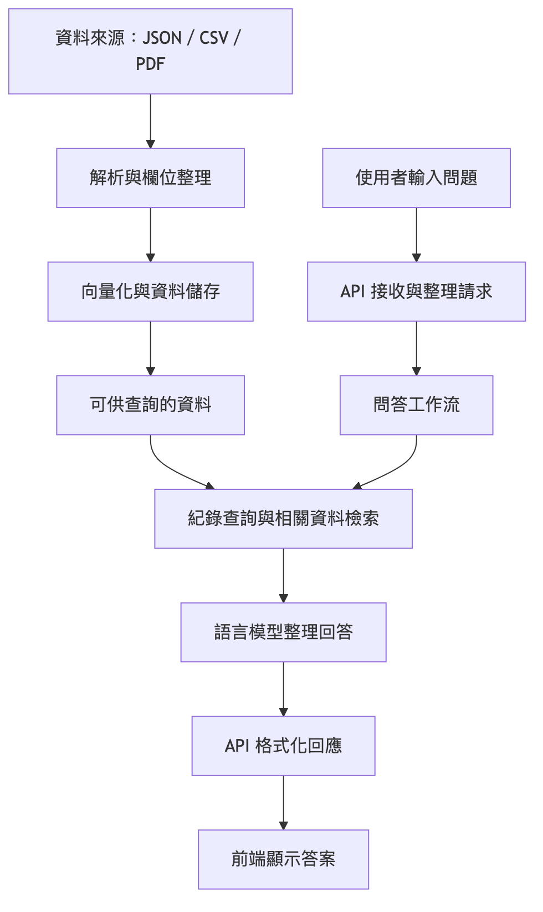
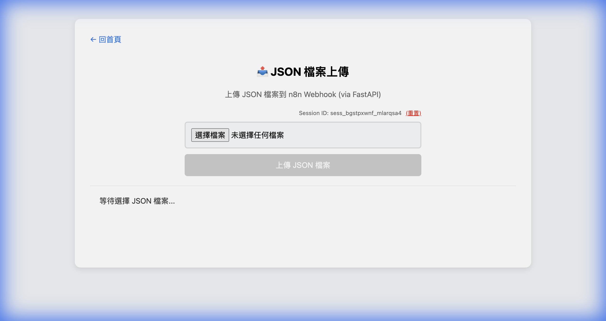
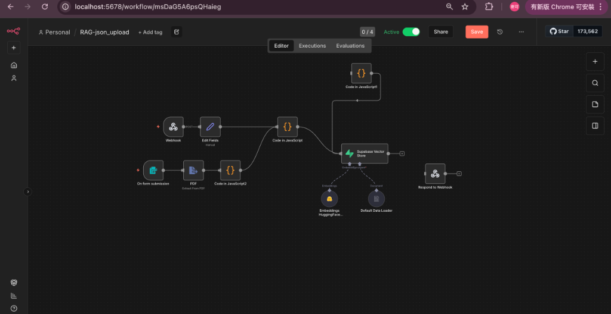
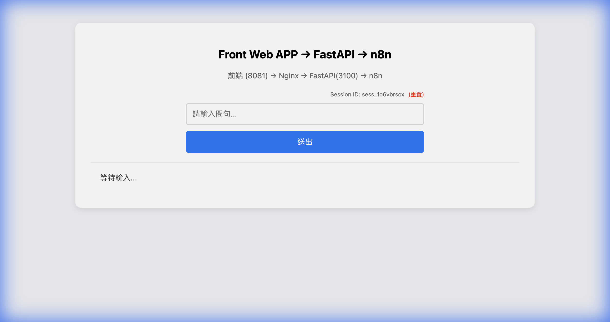

# 完整流程總覽

[返回目錄](../README.md)

以下為業務概念流程，資料匯入與問答是不同時間、不同入口觸發的作業。

[放大查看](../assets/diagrams/03-flow-overview-1.png) · [圖表原稿](../diagram-sources/03-flow-overview-1.mmd)

## 兩條主要路徑

1. 資料路徑：來源資料 → 解析整理 → 向量化 → 儲存。
2. 問答路徑：使用者問題 → API → 工作流 → 資料查詢與檢索 → 模型回答 → 前端。

規則提取與資料管理為配套流程，依各自入口執行，不代表每次問答都會重新匯入或處理規則。

詳見[資料處理流程](04-data-flow.md)與[問答流程](05-query-flow.md)。

## 交付資料實際畫面

以下為 2026-02-08 交付紀錄所附的原始截圖，用於對照介面與工作流。畫面保留當時版本，並非本次重新操作或執行結果；配置細節可能與概念流程圖不同。

### JSON 上傳介面

經 FastAPI 上傳 JSON 的檔案選擇與操作區；截圖為尚未選取檔案的畫面。

[放大查看](../assets/screenshots/json-upload.png) · 原始檔：`2.3_json_tool_fixed.png`

### JSON／PDF 匯入工作流

交付時的 n8n 畫布，呈現 Webhook、PDF 解析、資料整理、Embedding 與 Supabase 節點。

[放大查看](../assets/screenshots/workflow-json.png) · 原始檔：`3.1_RAG_json_upload_workflow.png`

### 網頁問答入口

問題輸入框、送出按鈕與回應區，對應前端呼叫 FastAPI 再串接 n8n 的入口。

[放大查看](../assets/screenshots/web-query.png) · 原始檔：`8081_API_Root.png`

### iPulse AI 助手

顯示 USER 001／002／003 測試使用者入口及 AI 助手歡迎畫面。

[放大查看](../assets/screenshots/portal-assistant.png) · 原始檔：`4.2_iPulse_Pass.png`

