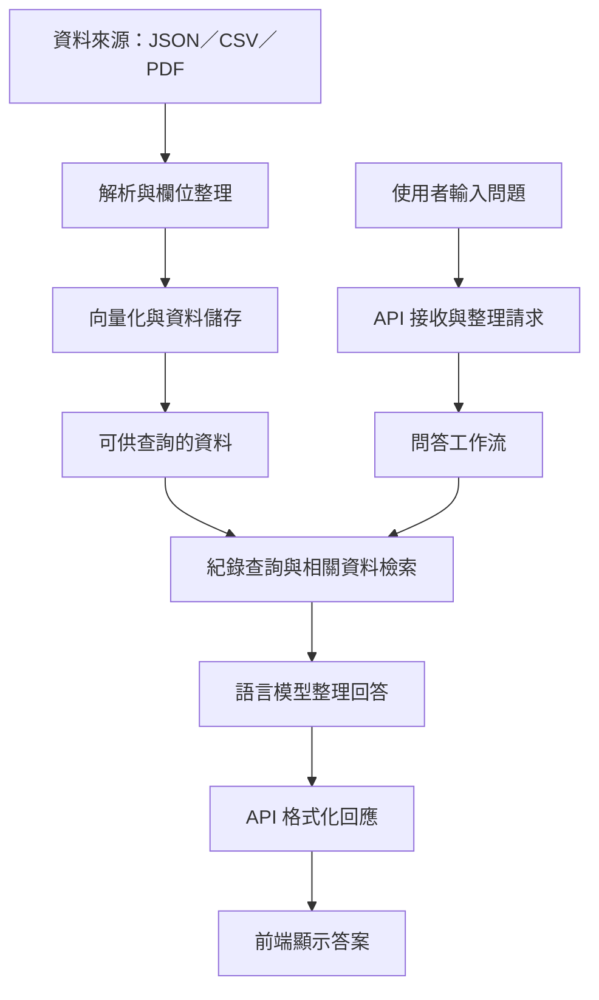

# 完整流程總覽

[返回目錄](../README.md)

以下為業務概念流程，資料匯入與問答是不同時間、不同入口觸發的作業。

## 兩條主要路徑

1. 資料路徑：來源資料 → 解析整理 → 向量化 → 儲存。
2. 問答路徑：使用者問題 → API → 工作流 → 資料查詢與檢索 → 模型回答 → 前端。

規則提取與資料管理為配套流程，依各自入口執行，不代表每次問答都會重新匯入或處理規則。

詳見[資料處理流程](04-data-flow.md)與[問答流程](05-query-flow.md)。
