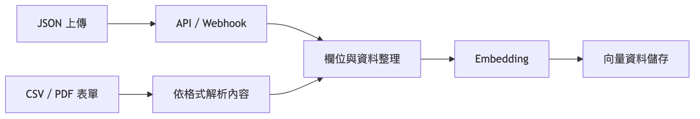

# 資料處理流程

[返回目錄](../README.md)

## 資料匯入

[放大查看](../assets/diagrams/04-data-flow-1.png) · [圖表原稿](../diagram-sources/04-data-flow-1.mmd)

此圖合併不同入口說明資料生命週期；實際解析節點依工作流及檔案格式配置。

## 規則處理

[放大查看](../assets/diagrams/04-data-flow-2.png) · [圖表原稿](../diagram-sources/04-data-flow-2.mmd)

## 資料管理

[放大查看](../assets/diagrams/04-data-flow-3.png) · [圖表原稿](../diagram-sources/04-data-flow-3.mmd)

資料管理圖以交付工作流中的刪除操作為範圍。
