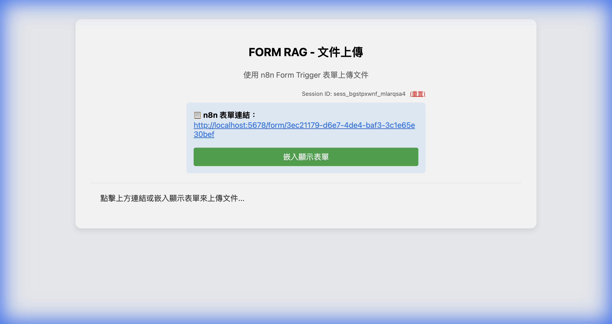
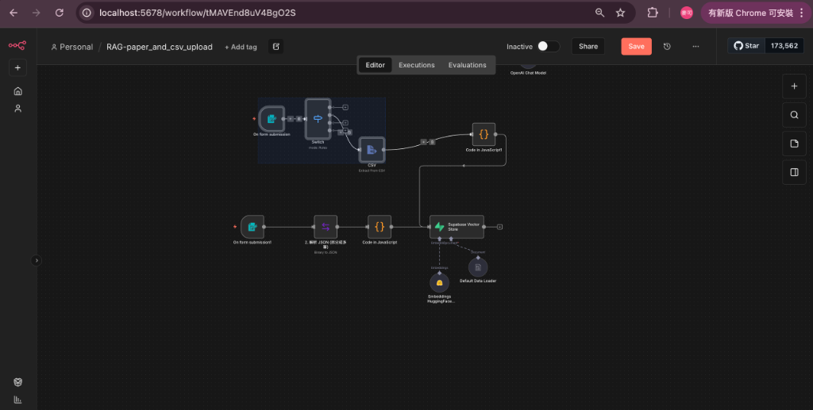
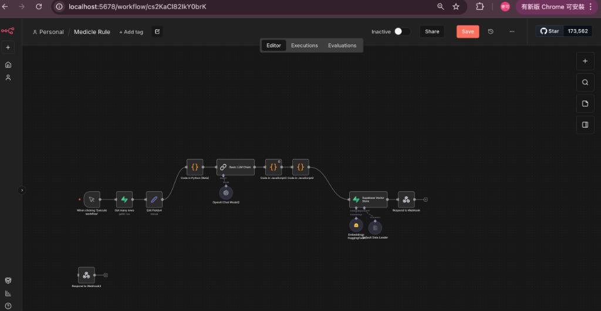
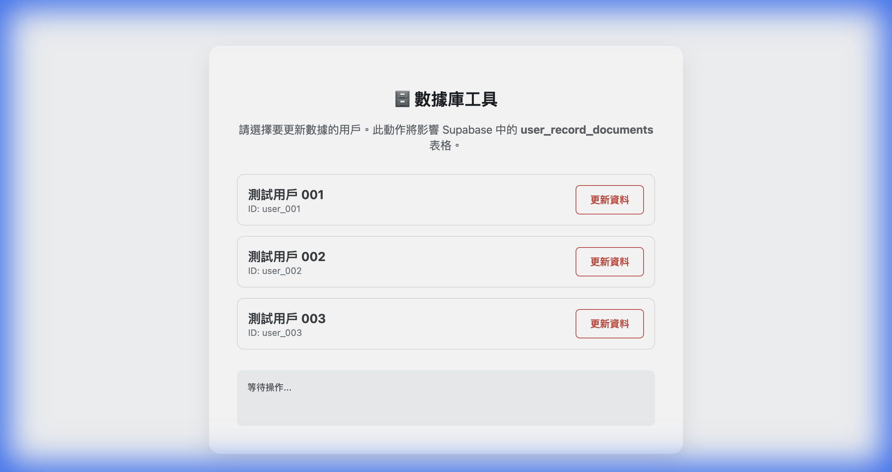
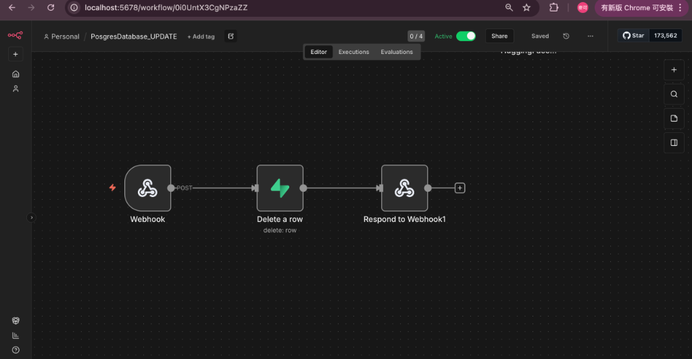

# 資料處理流程

[返回目錄](../README.md)

## 資料匯入

[放大查看](../assets/diagrams/04-data-flow-1.png) · [圖表原稿](../diagram-sources/04-data-flow-1.mmd)

此圖合併不同入口說明資料生命週期；實際解析節點依工作流及檔案格式配置。

## 規則處理

[放大查看](../assets/diagrams/04-data-flow-2.png) · [圖表原稿](../diagram-sources/04-data-flow-2.mmd)

## 資料管理

[放大查看](../assets/diagrams/04-data-flow-3.png) · [圖表原稿](../diagram-sources/04-data-flow-3.mmd)

資料管理圖以交付工作流中的刪除操作為範圍。

## 交付資料實際畫面

以下為 2026-02-08 交付紀錄所附的原始截圖，用於對照介面與工作流。畫面保留當時版本，並非本次重新操作或執行結果；配置細節可能與概念流程圖不同。

### JSON 上傳介面

經 FastAPI 上傳 JSON 的檔案選擇與操作區；截圖為尚未選取檔案的畫面。

[放大查看](../assets/screenshots/json-upload.png) · 原始檔：`2.3_json_tool_fixed.png`

### 文件表單入口

以 n8n Form Trigger 為入口的文件上傳頁；畫面中的 localhost 連結是截圖環境資訊，不是廠商操作網址。

[放大查看](../assets/screenshots/form-upload.png) · 原始檔：`2.4_RAG-paper_and_csv_upload.png`

### JSON／PDF 匯入工作流

交付時的 n8n 畫布，呈現 Webhook、PDF 解析、資料整理、Embedding 與 Supabase 節點。

[放大查看](../assets/screenshots/workflow-json.png) · 原始檔：`3.1_RAG_json_upload_workflow.png`

### 表單與 CSV 處理工作流

交付時的 n8n 畫布，呈現表單觸發、Switch、CSV 解析與向量儲存相關節點。

[放大查看](../assets/screenshots/workflow-csv.png) · 原始檔：`3.2_RAG_paper_csv_workflow.png`

### 規則提取工作流

呈現資料讀取、Python、LLM Chain、JavaScript 及 Supabase 節點的配置畫面。

[放大查看](../assets/screenshots/workflow-rules.png) · 原始檔：`3.4_Medicle_Rule_Workflow.png`

### 資料管理介面

列出三個測試使用者與「更新資料」按鈕，供辨識資料管理操作入口。

[放大查看](../assets/screenshots/data-management.png) · 原始檔：`2.1_PosgresDatabase_UPDATE.png`

### 資料管理工作流

畫面主線為 Webhook → Delete a row → Respond to Webhook；操作名稱以節點實際顯示為準。

[放大查看](../assets/screenshots/workflow-management.png) · 原始檔：`3.3_PosgresDatabase_UPDATE_workflow.png`

