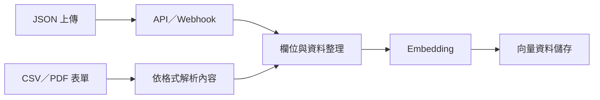
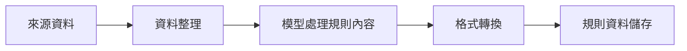
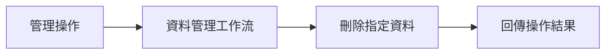

# 資料處理流程

[返回目錄](../README.md)

## 資料匯入

```mermaid
flowchart LR
    J["JSON 上傳"] --> A["API／Webhook"]
    A --> C["欄位與資料整理"]
    F["CSV／PDF 表單"] --> P["依格式解析內容"]
    P --> C
    C --> E["Embedding"]
    E --> V["向量資料儲存"]
```

此圖合併不同入口說明資料生命週期；實際解析節點依工作流及檔案格式配置。

## 規則處理

```mermaid
flowchart LR
    S["來源資料"] --> P["資料整理"]
    P --> L["模型處理規則內容"]
    L --> F["格式轉換"]
    F --> V["規則資料儲存"]
```

## 資料管理

```mermaid
flowchart LR
    U["管理操作"] --> W["資料管理工作流"]
    W --> D["刪除指定資料"]
    D --> R["回傳操作結果"]
```

資料管理圖以交付工作流中的刪除操作為範圍。
