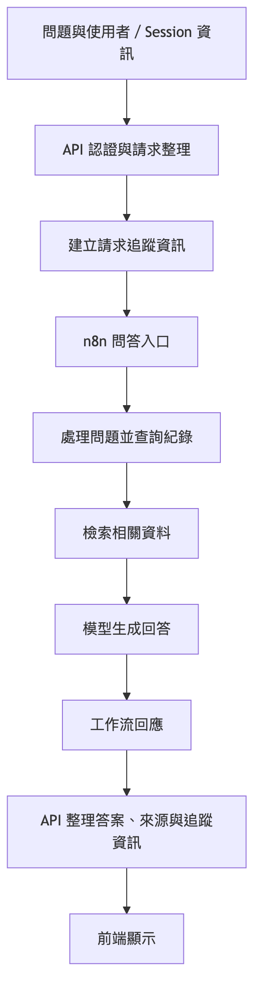

# 問答流程

[返回目錄](../README.md)

## 問答處理概念

[放大查看](../assets/diagrams/05-query-flow-1.png) · [圖表原稿](../diagram-sources/05-query-flow-1.mmd)

## 輸入與輸出

| 項目 | 說明 |
|---|---|
| 問題 | 使用者希望查詢的內容 |
| 使用者識別 | 請求攜帶的使用者資訊 |
| Session | 對話識別資訊；是否保存與使用上下文取決於對應流程 |
| 答案 | 工作流回傳並由 API 整理的內容 |
| 來源 | 依工作流回傳內容提供，可為空 |
| 追蹤資訊 | 用於對應 API 請求的識別碼 |

以上為問答服務的職責說明，不以概念圖指定正式環境使用的工作流版本或模型。
