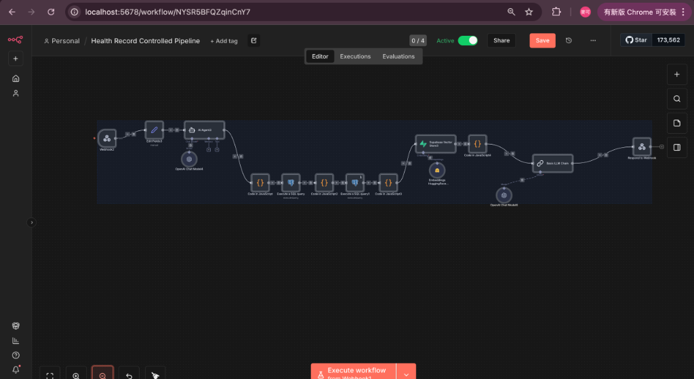
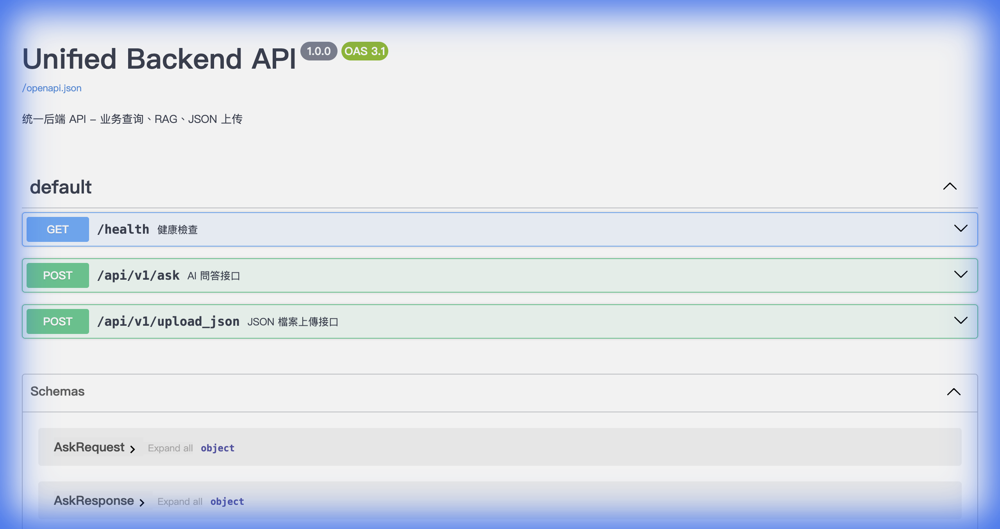

# 問答流程

[返回目錄](../README.md)

## 問答處理概念

[放大查看](../assets/diagrams/05-query-flow-1.png) · [圖表原稿](../diagram-sources/05-query-flow-1.mmd)

## 輸入與輸出

| 項目 | 說明 |
|---|---|
| 問題 | 使用者希望查詢的內容 |
| 使用者識別 | 請求攜帶的使用者資訊 |
| Session | 對話識別資訊；是否保存與使用上下文取決於對應流程 |
| 答案 | 工作流回傳並由 API 整理的內容 |
| 來源 | 依工作流回傳內容提供，可為空 |
| 追蹤資訊 | 用於對應 API 請求的識別碼 |

以上為問答服務的職責說明，不以概念圖指定正式環境使用的工作流版本或模型。

## 交付資料實際畫面

以下為 2026-02-08 交付紀錄所附的原始截圖，用於對照介面與工作流。畫面保留當時版本，並非本次重新操作或執行結果；配置細節可能與概念流程圖不同。

### 網頁問答入口

問題輸入框、送出按鈕與回應區，對應前端呼叫 FastAPI 再串接 n8n 的入口。

[放大查看](../assets/screenshots/web-query.png) · 原始檔：`8081_API_Root.png`

### iPulse AI 助手

顯示 USER 001／002／003 測試使用者入口及 AI 助手歡迎畫面。

[放大查看](../assets/screenshots/portal-assistant.png) · 原始檔：`4.2_iPulse_Pass.png`

### 健康紀錄查詢工作流

交付時的 Health Record Controlled Pipeline 畫布，呈現查詢、檢索及模型處理相關節點；為歷史配置畫面。

[放大查看](../assets/screenshots/workflow-health.png) · 原始檔：`4.5_Health_Record_Pipeline_workflow.png`

### 統一後端 API 文件

Swagger 畫面列出健康檢查、AI 問答與 JSON 上傳接口，對應架構中的 FastAPI 服務層。

[放大查看](../assets/screenshots/api-swagger.png) · 原始檔：`1.3_swagger_ui.png`

